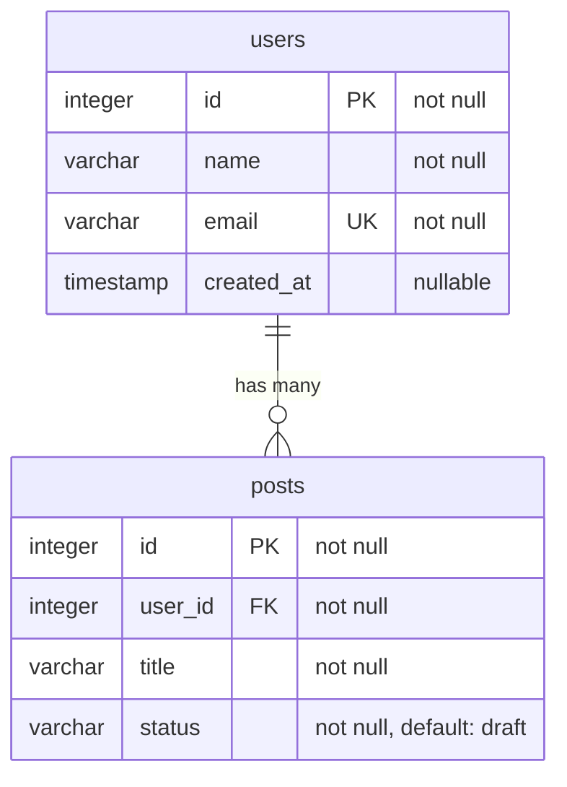

# Laravel ER

Automatically generate ER diagrams from your Laravel database schema. One command, zero configuration required.

```bash
php artisan er:generate
```

## Why?

**Give AI agents full context of your database.** Drop the generated `er-diagram.md` into your project root and every AI coding assistant (Claude Code, Cursor, GitHub Copilot, ...) instantly understands your tables, columns, types, relationships, and constraints. No more explaining your schema by hand in every prompt.

But that's not all. The same file works as:

- **Living documentation** that stays in sync with your actual database, versioned alongside your code.
- **Visual diagrams** that render natively on GitHub, GitLab, and Notion, so your team can understand complex schemas at a glance.

## Requirements

- PHP 8.2+
- Laravel 11 or 12

## Installation

```bash
composer require paolobellini/laravel-er --dev
```

The service provider is auto-discovered. No manual registration needed.

## Configuration

Optionally publish the config file to customize the behavior:

```bash
php artisan vendor:publish --tag=er-config
```

This creates `config/er.php` with the following options:

```php
return [
    // Where the generated file will be saved
    'output_path' => base_path(),

    // The filename (without extension)
    'output_filename' => 'er-diagram',

    // Tables to exclude from the diagram
    'excluded_tables' => [
        'migrations',
        'failed_jobs',
        'password_reset_tokens',
        'sessions',
        'cache',
        'cache_locks',
        'jobs',
        'job_batches',
    ],

    // Default renderer
    'renderer' => 'mermaid',

    // Available renderers
    'renderers' => [
        'mermaid' => MermaidRenderer::class,
        'dbdiagram' => DbDiagramRenderer::class,
    ],
];
```

## Usage

### Generate with the default renderer (Mermaid)

```bash
php artisan er:generate
```

### Choose a specific format

```bash
php artisan er:generate --format=mermaid
php artisan er:generate --format=dbdiagram
```

### Output

The diagram is saved to `er-diagram.md` in your project root by default.

## Supported Formats

### Mermaid

Generates a [Mermaid](https://mermaid.js.org/) ER diagram wrapped in a fenced code block. Renders natively on GitHub, GitLab, Notion, and many other platforms.



### dbdiagram

Generates a [dbdiagram.io](https://dbdiagram.io/) compatible schema. Copy and paste the output into dbdiagram.io to get an interactive visual diagram.

```
Table users {
  id integer [primary key, not null]
  name varchar(255) [not null]
  email varchar(255) [not null, unique]
  created_at timestamp [null]
}
Table posts {
  id integer [primary key, not null]
  user_id integer [not null]
  title varchar(255) [not null]
  status varchar [not null, default: 'draft']
}
Ref: posts.user_id > users.id
```

## Column Details

The generated diagrams include rich column metadata:

| Detail | Mermaid | dbdiagram |
|---|---|---|
| Primary key | `PK` marker | `primary key` attribute |
| Foreign key | `FK` marker + relationship line | `Ref:` statement |
| Unique | `UK` marker | `unique` attribute |
| Nullable | `nullable` / `not null` in comment | `null` / `not null` attribute |
| Default value | `default: value` in comment | `default: 'value'` attribute |
| Type details | `(255)`, `unsigned`, `values: ...` in comment | Full type preserved |

## Relationship Detection

Relationships are automatically inferred from foreign keys:

| Scenario | Mermaid | dbdiagram |
|---|---|---|
| FK without unique index | `\|\|--o{` (one-to-many) | `>` (many-to-one) |
| FK with unique index | `\|\|--\|\|` (one-to-one) | `-` (one-to-one) |
| Nullable FK | `o\|--` (zero-or-one) | `>` / `-` |

## Testing

```bash
composer test
```

This runs the full test suite: linting, type coverage, unit tests, static analysis, and refactoring checks.

## Contributing

Contributions are welcome! Please read the [contributing guide](CONTRIBUTING.md) to get started.

## Credits

- [Paolo Bellini](https://bellini.one)
- [All Contributors](https://github.com/paolobellini/laravel-er/graphs/contributors)

## License

[MIT](LICENSE)
